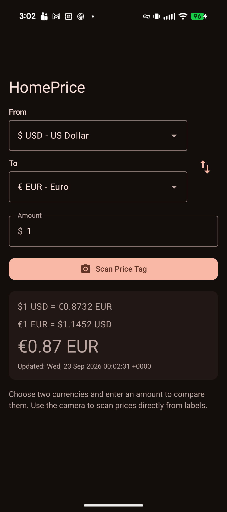
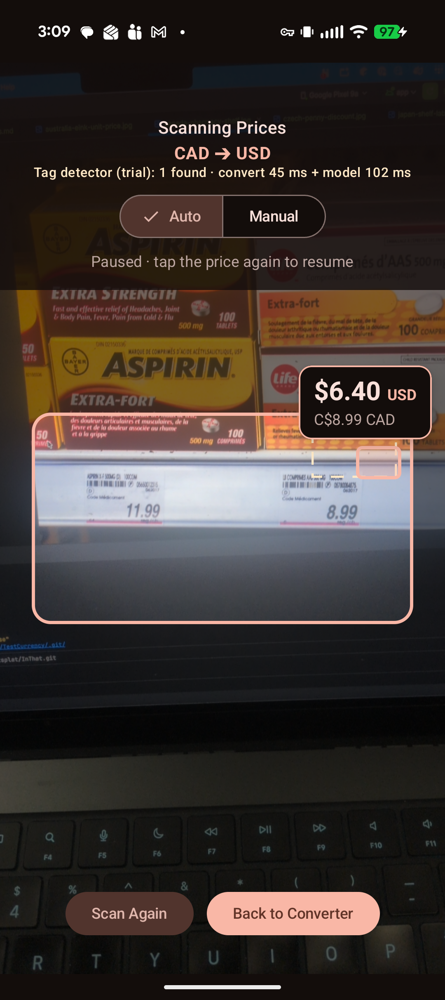

# HomePrice

An Android currency converter that can read prices straight off a price tag with the camera.

<p align="center">
  
  &nbsp;&nbsp;
  
</p>

## Features

- **Converter** – pick two currencies, enter an amount, and see the converted value and both exchange rates. Rates come from [open.er-api.com](https://open.er-api.com) and are cached, so conversions keep working if a refresh fails.
- **Price scanner** – fit a price tag in the on-screen aim box and every number in it that could be a price is highlighted. Two modes:
  - **Manual** (default) – tap the real price to see it converted; the frame freezes so you can tap another, and **Scan Again** resumes the live camera.
  - **Auto** – the main price on each tag shows its conversion live, no tapping needed. Tap a price to pause on it and tap it again to resume.
  - Barcodes/SKUs, dates, sizes (`10 OZ`, `2L`) and unit prices (`37.9¢`) are filtered out automatically.
- Light and dark themes, with Material You dynamic color on Android 12+.
- Available in English, Spanish, French, German, Italian, Portuguese, Japanese, Korean and Simplified Chinese. Currency names, money and dates follow the phone's language, and on Android 13+ you can choose HomePrice's language on its own in Settings → Apps → HomePrice → Language.

## Tech stack

- Kotlin, Jetpack Compose, Material 3
- CameraX + ML Kit Text Recognition (on-device OCR)
- Ktor client for the exchange-rate API

## Requirements

- Android Studio (recent stable)
- JDK 11+
- Android device or emulator running Android 11 (API 30) or later; a real device with a camera is needed for the scanner

## Build and run

```sh
./gradlew :app:assembleDebug      # build the debug APK
./gradlew :app:installDebug       # install on a connected device
./gradlew :app:testDebugUnitTest  # run unit tests
./gradlew :app:connectedAndroidTest  # run instrumented tests (device required)
```

Or open the project in Android Studio and run the `app` configuration.

## Project structure

```
app/src/main/java/splatdevelopment/homeprice/
├── MainActivity.kt          # Entry point, switches between converter and scanner
├── ConverterScreen.kt       # Converter UI
├── analyzer/PriceAnalyzer.kt  # Finds candidate prices in OCR text
├── data/CurrencyCatalog.kt  # Supported currencies
├── domain/                  # ConverterController and UI state
├── model/                   # Currency and exchange-rate models
├── network/                 # Exchange-rate API client
└── ui/                      # Scanner screen, overlay, theme
```

See [CODING_STANDARDS.md](CODING_STANDARDS.md) for contribution guidelines and [docs/price-detection-options.md](docs/price-detection-options.md) for how the price scanner could become more accurate.

## License

[MIT](LICENSE). The images in [docs/test-images](docs/test-images) keep their own Creative Commons / public-domain licenses; see that folder's README.
